# Azure Terraform DevSecOps Container Platform

A production-inspired Azure DevSecOps project that deploys a containerized FastAPI application using Terraform, Docker, Azure Container Apps, Azure Container Registry, Managed Identity, Key Vault, Application Insights, Log Analytics and GitHub Actions with OIDC.

The project demonstrates an end-to-end cloud workflow:

```text
Pull Request
   ↓
Automated validation
   ↓
Merge to main
   ↓
Docker image build
   ↓
Push to Azure Container Registry
   ↓
Terraform deployment
   ↓
Azure Container App update
   ↓
Post-deployment smoke test
```

The main goal of this project is not only to deploy an application, but to design and document a secure, automated, observable and cost-conscious cloud platform.

---

## Project Highlights

This project demonstrates:

* Infrastructure as Code with Terraform.
* Terraform remote state on Azure Storage.
* Modular Terraform structure.
* Containerized FastAPI application.
* Private container image storage with Azure Container Registry.
* Serverless container hosting with Azure Container Apps.
* Managed Identity-based access.
* Azure RBAC authorization.
* Azure Key Vault secret management.
* Secret value kept out of Terraform state.
* Application telemetry with Azure Monitor OpenTelemetry.
* Log collection with Log Analytics.
* Pull Request validation with GitHub Actions.
* Security scanning with Checkov and Trivy.
* Secretless Azure authentication from GitHub Actions using OIDC.
* Docker image tagging with Git commit SHA.
* Automated post-deployment smoke testing.

---

## Architecture Overview


The platform is built around two main Azure resource groups:

```text
rg-tfstate-devsecops-container-dev-gwc
```

Used for Terraform remote state.

```text
rg-devsecops-container-dev-gwc
```

Used for the application platform resources.

The Azure Container App pulls a private container image from Azure Container Registry using a runtime Managed Identity.

The application reads secrets from Azure Key Vault through a Key Vault secret reference.

Application logs and telemetry are sent to Log Analytics and Application Insights.

GitHub Actions deploys the application using a separate Managed Identity authenticated through OIDC, without storing Azure client secrets in GitHub.

More details are available in:

* [Architecture Overview](docs/architecture.md)
* [Diagrams](docs/diagrams.md)

---

## CI/CD Flow


The CI/CD process is split into two main workflows.

### Pull Request Validation

Pull Requests targeting `main` trigger automated validation:

* Terraform formatting check.
* Terraform validation.
* Docker image build.
* Checkov Infrastructure as Code scan.
* Trivy filesystem and container image scan.

### Deployment on Main

After merging into `main`, the deployment workflow:

1. Authenticates to Azure using GitHub OIDC.
2. Builds the Docker image.
3. Tags the image with the Git commit SHA.
4. Pushes the image to Azure Container Registry.
5. Applies the Terraform app stack.
6. Updates the Azure Container App.
7. Resolves the stable Container App URL.
8. Runs a smoke test against the deployed application.
9. Writes a deployment summary in GitHub Actions.

More details are available in:

* [Deployment Flow](docs/deployment-flow.md)
* [Security Scanning Strategy](docs/security-scanning.md)

---

## Technology Stack

| Area                   | Technology                                         |
| ---------------------- | -------------------------------------------------- |
| Application            | Python, FastAPI, Uvicorn                           |
| Containerization       | Docker                                             |
| Infrastructure as Code | Terraform                                          |
| Cloud Provider         | Microsoft Azure                                    |
| Container Registry     | Azure Container Registry                           |
| Runtime                | Azure Container Apps                               |
| Secrets                | Azure Key Vault                                    |
| Identity               | User Assigned Managed Identity                     |
| Access Control         | Azure RBAC                                         |
| Observability          | Log Analytics, Application Insights, OpenTelemetry |
| CI/CD                  | GitHub Actions                                     |
| Cloud Authentication   | GitHub OIDC                                        |
| Security Scanning      | Checkov, Trivy                                     |
| Scripting              | PowerShell                                         |

---

## Repository Structure

```text
.
├── app/
│   ├── Dockerfile
│   ├── .dockerignore
│   ├── main.py
│   └── requirements.txt
│
├── infra/
│   ├── bootstrap/
│   ├── core/
│   └── app/
│
├── scripts/
│   ├── azure-preflight-checks.ps1
│   ├── local-docker-test.ps1
│   └── smoke-test-container-app.ps1
│
├── docs/
│   ├── architecture.md
│   ├── cleanup.md
│   ├── cost-management.md
│   ├── deployment-flow.md
│   ├── diagrams.md
│   ├── observability.md
│   ├── security.md
│   ├── security-scanning.md
│   ├── troubleshooting.md
│   ├── diagrams/
│   └── screenshots/
│
└── .github/
    └── workflows/
        ├── pr-checks.yml
        └── deploy.yml
```

---

## Terraform Design

The Terraform code is split into three stacks:

```text
infra/bootstrap
infra/core
infra/app
```

### `infra/bootstrap`

Creates the Terraform remote state backend:

* Resource Group for Terraform state.
* Azure Storage Account.
* Blob container for state files.
* Required RBAC assignment for state access.

This stack exists because the remote backend must exist before the other Terraform stacks can use it.

### `infra/core`

Creates the shared platform infrastructure:

* Application Resource Group.
* Azure Container Registry.
* Log Analytics Workspace.
* Application Insights.
* Azure Key Vault.
* Runtime Managed Identity.
* GitHub Actions Managed Identity.
* Azure Container Apps Environment.
* RBAC role assignments.
* Federated Identity Credential for GitHub Actions OIDC.

### `infra/app`

Deploys the Azure Container App.

This stack reads outputs from the core stack using Terraform remote state, including:

* ACR login server.
* Container Apps Environment ID.
* Runtime Managed Identity ID.
* Key Vault secret URI.
* Application Insights connection string.

This separation keeps the shared platform foundation independent from the application deployment layer.

---

## Application

The project includes a small FastAPI application designed to validate the platform.

Main endpoints:

| Endpoint         | Purpose                                                |
| ---------------- | ------------------------------------------------------ |
| `/`              | Basic application response                             |
| `/health`        | Health check endpoint                                  |
| `/config`        | Non-sensitive runtime configuration                    |
| `/version`       | Application version and deployed commit SHA            |
| `/secret-status` | Secret loading validation without exposing the secret  |
| `/error-test`    | Controlled error endpoint for observability validation |

The app is intentionally simple because the focus of the project is the cloud platform around it.

---

## Containerization

The application is packaged using Docker.

Container design choices include:

* Python slim base image.
* `.dockerignore` to keep the image clean.
* Non-root application user.
* Exposed port `8000`.
* Docker healthcheck using `/health`.
* Uvicorn as the ASGI server.

The image is built locally for validation and automatically in GitHub Actions for deployment.

---

## Security Model


Security is one of the main focuses of the project.

Key security decisions:

* Azure Container Registry admin user is disabled.
* Container App uses Managed Identity instead of registry credentials.
* Runtime identity has only `AcrPull` on ACR.
* Runtime identity has only `Key Vault Secrets User` on Key Vault.
* GitHub Actions uses a separate Managed Identity.
* GitHub Actions authenticates to Azure through OIDC.
* No Azure client secret is stored in GitHub.
* Secret values are not managed by Terraform.
* Secret values are not committed to Git.
* Terraform state files are not committed to Git.
* Local backend and variable files are ignored.

The project uses two separate Managed Identities:

| Identity                        | Purpose                                    |
| ------------------------------- | ------------------------------------------ |
| Runtime Managed Identity        | Used by the Azure Container App            |
| GitHub Actions Managed Identity | Used by GitHub Actions deployment workflow |

The runtime identity can pull images and read secrets.

The deployment identity can push images, access Terraform remote state and apply infrastructure changes.

This separation prevents the running application from having deployment-level permissions.

More details are available in:

* [Security Model](docs/security.md)

---

## Secret Management


Azure Key Vault is used to store application secrets.

Important design choice:

```text
Terraform creates the Key Vault and RBAC permissions,
but Terraform does not manage the actual secret value.
```

This is intentional because secret values managed by Terraform can be stored in Terraform state.

The Container App reads the secret using a Key Vault secret reference and the runtime Managed Identity.

The application validates secret loading through:

```text
/secret-status
```

The endpoint confirms whether the secret is loaded, but it never exposes the secret value.

---

## Observability

The project uses:

* Log Analytics for platform and container logs.
* Application Insights for application telemetry.
* Azure Monitor OpenTelemetry for FastAPI telemetry export.

The application receives the Application Insights connection string through environment configuration.

Telemetry initialization is fail-safe:

```text
If telemetry configuration fails,
the application continues to start.
```

This avoids making observability a single point of failure.

The `/error-test` endpoint can be used to generate a controlled error and validate exception tracking.

More details are available in:

* [Observability](docs/observability.md)

---

## GitHub Actions Workflows

The repository contains two main workflows.

### PR Checks

Workflow file:

```text
.github/workflows/pr-checks.yml
```

Runs on Pull Requests targeting `main`.

Jobs:

* Terraform checks.
* Docker build.
* Checkov IaC scan.
* Trivy security scan.

### Deploy Container App

Workflow file:

```text
.github/workflows/deploy.yml
```

Runs on push to `main` and manual dispatch.

Main steps:

* Checkout repository.
* Set up Terraform.
* Azure login with OIDC.
* Resolve ACR login server.
* Log in to ACR.
* Build Docker image.
* Push Docker image.
* Create temporary Terraform backend configuration.
* Terraform init, validate, plan and apply.
* Resolve Container App URL.
* Run smoke test.
* Write deployment summary.

---

## Deployment Verification

The deployment workflow runs a smoke test after Terraform apply.

Smoke test script:

```text
scripts/smoke-test-container-app.ps1
```

The smoke test validates:

* `/health`
* `/config`
* `/version`
* `/secret-status`

It checks that:

* The app is healthy.
* The runtime environment is correct.
* The Azure region is correct.
* The app runs on Azure Container Apps.
* Application Insights is configured.
* The deployed commit SHA matches the expected GitHub commit.
* The Key Vault secret is loaded.
* The secret value is not exposed.

This ensures that the workflow validates the real application behavior, not only the Terraform deployment result.

---

## Screenshots

### GitHub PR Checks

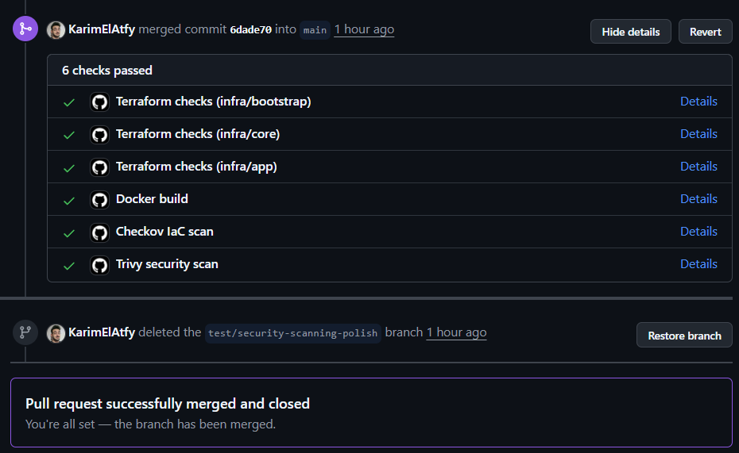

### GitHub Deploy Workflow

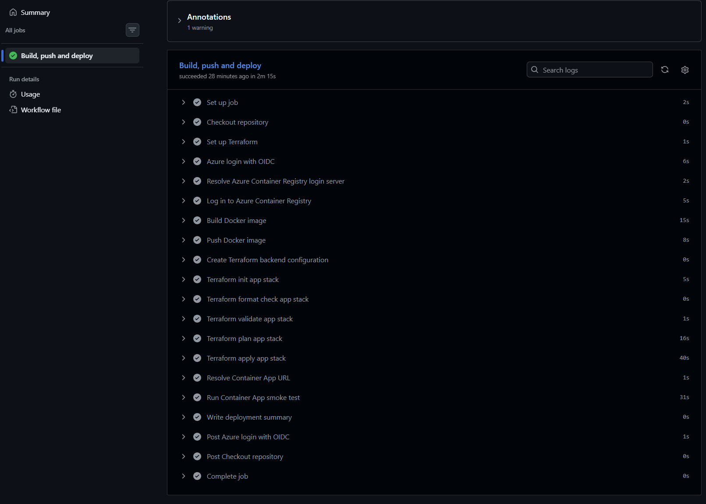

### GitHub Deployment Summary

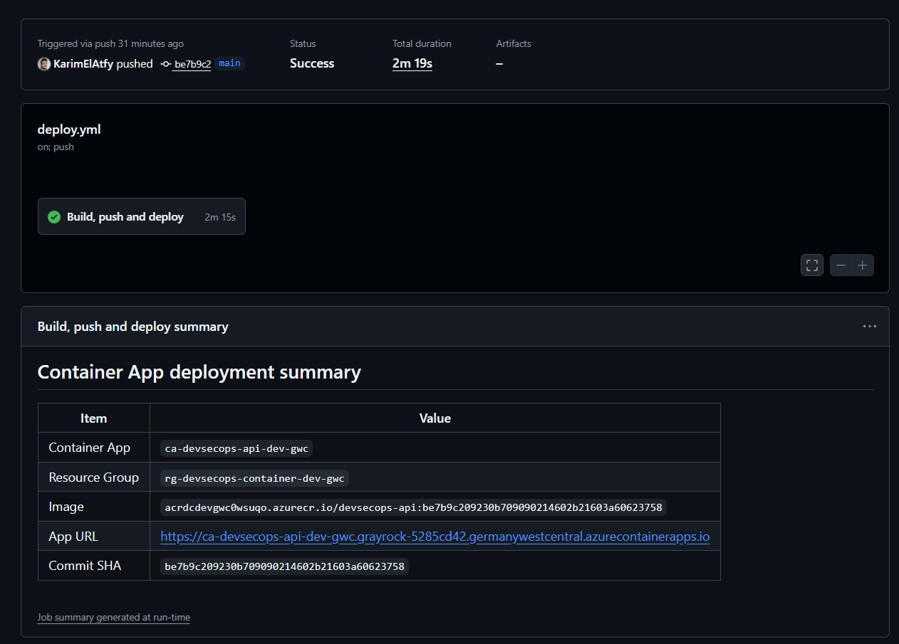

### Azure Resource Group

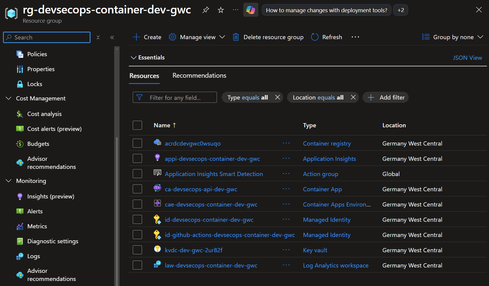

### Azure Container App Overview

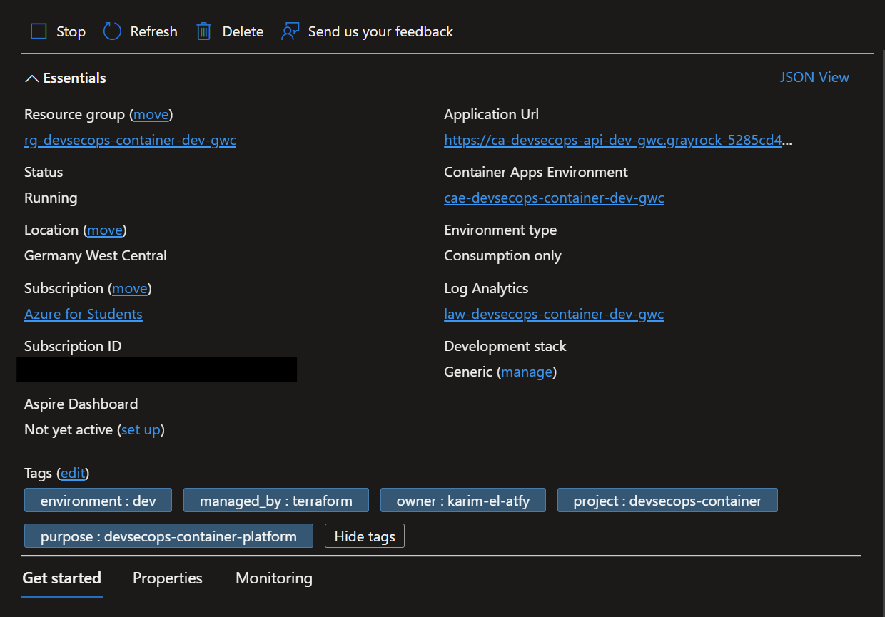

### Application Health Endpoint

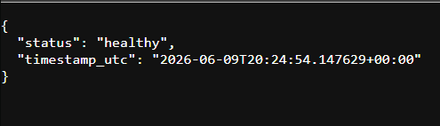

### Azure Container Registry Tags

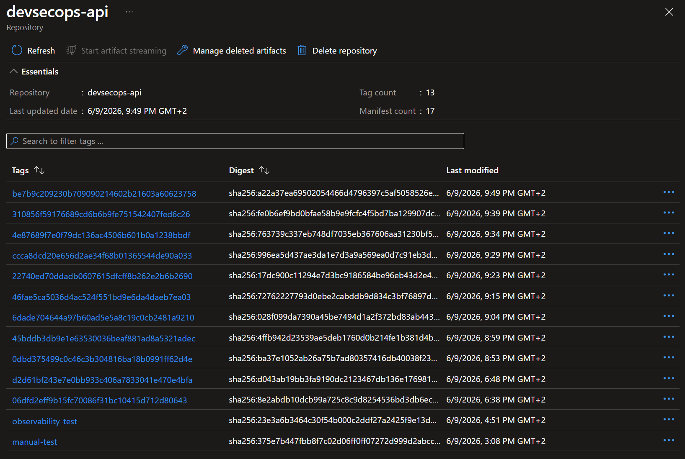

### Key Vault Secret Metadata

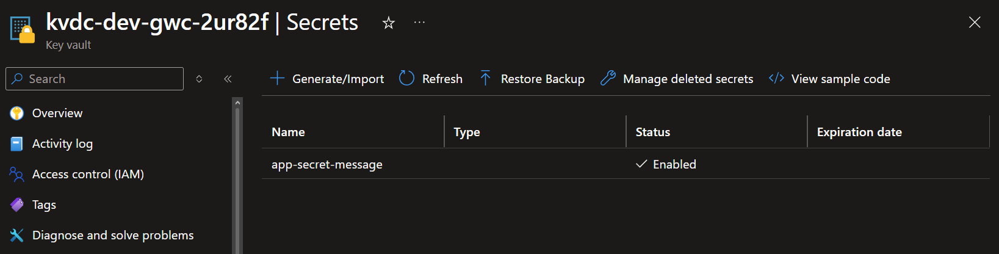

### Local Smoke Test Output

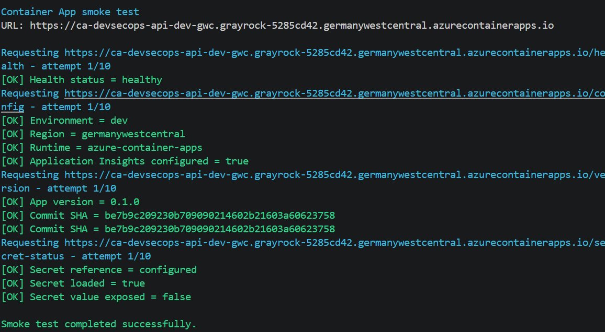

---

## Cost-Conscious Design

This project is designed for a personal development and portfolio environment.

Cost-conscious choices include:

* Azure Container Apps instead of AKS.
* Azure Container Registry Basic SKU.
* Minimum replicas set to `0`.
* Maximum replicas set to `1`.
* No Azure Firewall in version 1.
* No NAT Gateway in version 1.
* No Private Endpoints in version 1.
* No Application Gateway or WAF in version 1.
* Single development environment.

These choices reduce cost and complexity while still demonstrating strong cloud engineering practices.

The project does not claim to be a fully private enterprise production platform.

Instead, it is a realistic and explainable development platform that can be hardened further for production.

More details are available in:

* [Cost Management](docs/cost-management.md)

---

## Production Hardening Roadmap

Future improvements could include:

* Separate dev, staging and production environments.
* GitHub Environments with approval gates.
* Private Endpoints for Key Vault, ACR and Storage.
* Private Container Apps Environment.
* Application Gateway with WAF.
* Controlled egress through Azure Firewall or NAT Gateway.
* More restrictive custom RBAC roles.
* Azure Policy enforcement.
* Stronger Checkov blocking rules.
* Image signing.
* SBOM generation.
* Container image cleanup policy.
* Alert rules and action groups.
* Custom Application Insights dashboards.
* Availability tests.
* More detailed OpenTelemetry spans.
* Structured JSON logging.
* Microsoft Defender for Cloud integration.

---

## Local Validation

### Prerequisites

Required tools:

* Git
* Docker Desktop
* Azure CLI
* Terraform
* PowerShell

### Run local Docker validation

```powershell
.\scripts\local-docker-test.ps1
```

This script builds the Docker image, runs the container locally and validates the main endpoints.

### Run Azure preflight checks

```powershell
.\scripts\azure-preflight-checks.ps1
```

This script checks local tools, Azure login, Docker Engine status and required Azure resource providers.

### Run smoke test against deployed app

```powershell
$appFqdn = az containerapp show `
  --name ca-devsecops-api-dev-gwc `
  --resource-group rg-devsecops-container-dev-gwc `
  --query "properties.configuration.ingress.fqdn" `
  -o tsv

$appUrl = "https://$appFqdn"

$expectedSha = git rev-parse HEAD

.\scripts\smoke-test-container-app.ps1 `
  -AppUrl $appUrl `
  -ExpectedCommitSha $expectedSha
```

---

## Deployment Notes

This project uses remote Terraform state.

The real backend configuration and variable files are intentionally not committed.

Ignored files include:

```text
terraform.tfvars
backend.tf
.terraform/
*.tfstate
*.tfstate.*
.env
```

Example files should be used as templates when reproducing the project.

---

## Cleanup

Cleanup must be done in the correct order:

```text
1. infra/app
2. infra/core
3. infra/bootstrap
```

The app stack should be destroyed first because it depends on the core infrastructure.

The bootstrap stack should be destroyed last because it contains the Terraform remote state backend.

More details are available in:

* [Cleanup Guide](docs/cleanup.md)

---

## Troubleshooting

Real issues encountered during the project are documented in:

* [Troubleshooting Guide](docs/troubleshooting.md)

Covered topics include:

* Docker Engine not running.
* Terraform module initialization.
* Azure resource provider registration.
* Key Vault RBAC propagation delay.
* Container App unavailable page.
* Application telemetry fail-safe behavior.
* Trivy unfixed vulnerabilities.
* Checkov findings in a development environment.
* App Registration permission issues.
* GitHub Actions OIDC validation.
* Smoke test failures.

---

## Documentation Index

| Document                                       | Description                                            |
| ---------------------------------------------- | ------------------------------------------------------ |
| [Architecture Overview](docs/architecture.md)  | Main Azure architecture and Terraform stack separation |
| [Deployment Flow](docs/deployment-flow.md)     | Pull Request, CI/CD and deployment flow                |
| [Security Model](docs/security.md)             | Managed Identity, RBAC, Key Vault and OIDC model       |
| [Security Scanning](docs/security-scanning.md) | Checkov and Trivy scanning strategy                    |
| [Observability](docs/observability.md)         | Log Analytics, Application Insights and telemetry      |
| [Troubleshooting](docs/troubleshooting.md)     | Real issues encountered and how they were solved       |
| [Cost Management](docs/cost-management.md)     | Cost-conscious design decisions                        |
| [Cleanup Guide](docs/cleanup.md)               | Safe infrastructure destroy order                      |
| [Diagrams](docs/diagrams.md)                   | Architecture, CI/CD, identity and secret flow diagrams |

---

## What This Project Demonstrates

This project demonstrates the ability to:

* Design a cloud-native Azure container platform.
* Use Terraform to manage infrastructure.
* Split Terraform into maintainable stacks.
* Use remote state safely.
* Containerize and deploy an application.
* Use Azure Container Registry securely.
* Deploy to Azure Container Apps.
* Use Managed Identity and RBAC.
* Store secrets in Key Vault.
* Avoid static cloud credentials in CI/CD.
* Configure GitHub Actions OIDC.
* Add Infrastructure as Code security scanning.
* Add container image vulnerability scanning.
* Configure observability with Application Insights.
* Validate deployments with smoke tests.
* Document architecture, security, cost and troubleshooting decisions.

---

## Final Result

The final platform provides a complete DevSecOps workflow:

```text
Developer opens a Pull Request
   ↓
GitHub Actions validates Terraform, Docker and security scans
   ↓
Pull Request is merged into main
   ↓
GitHub Actions authenticates to Azure using OIDC
   ↓
Docker image is built and pushed to Azure Container Registry
   ↓
Terraform updates the Azure Container App
   ↓
The deployed app is validated with smoke tests
   ↓
Logs and telemetry are available through Azure observability services
```

The result is a secure, automated, observable and cost-conscious Azure container platform suitable for a professional cloud engineering portfolio.
